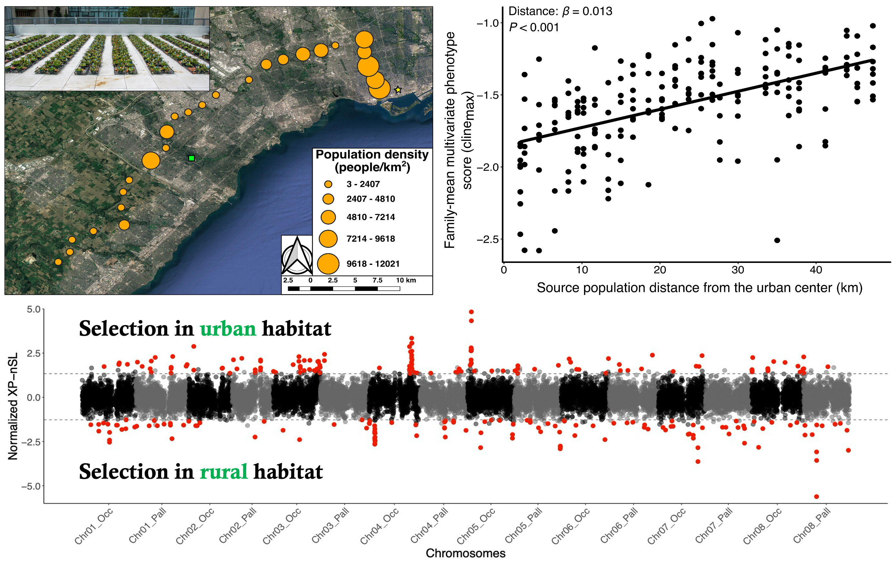
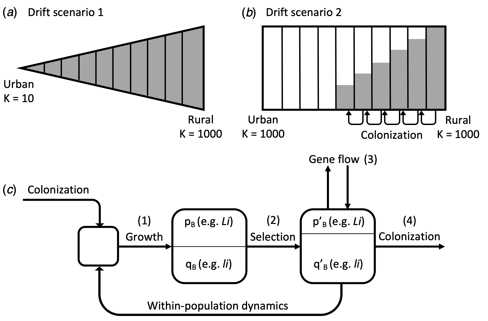
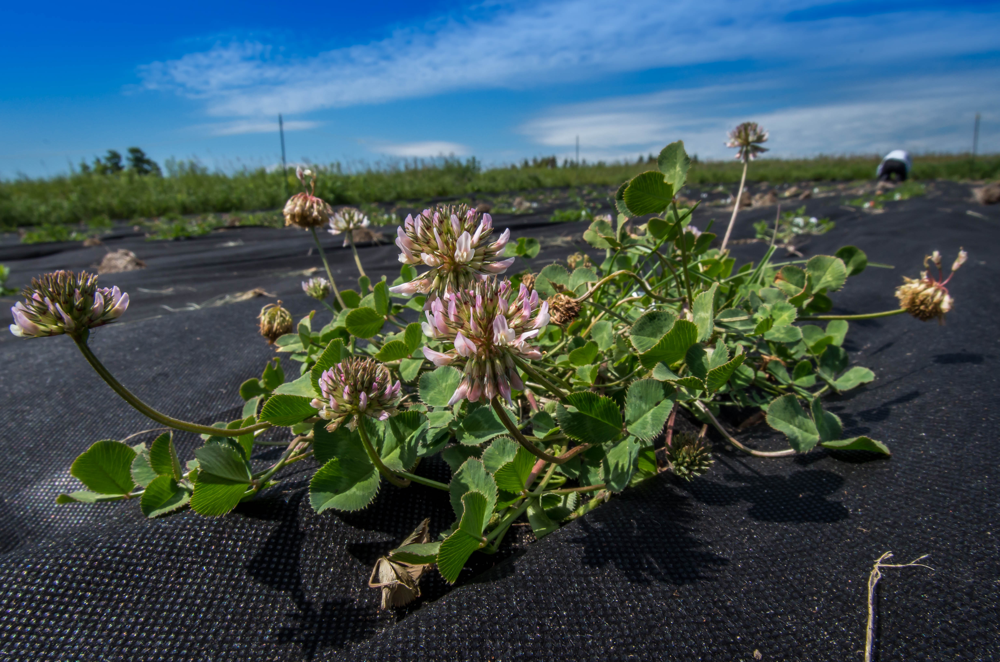
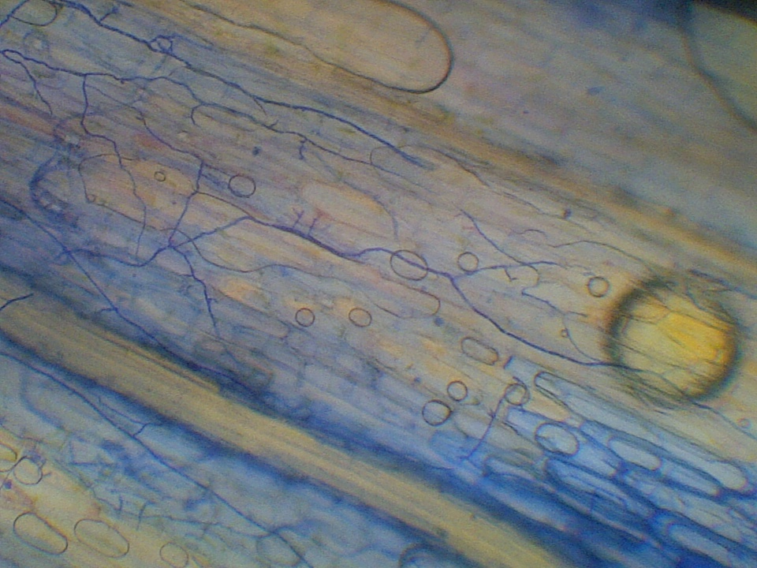

## Evolution in urban environments

### Urban-rural cyanogenesis (HCN) clines

*Figure 1: Map of cities samples as part of the Global Urban Evolution Project. Cities with positive clines (HCNUrban < HCNRural) are colored blue while cities with negative clines(HCNUrban < HCNRural)*

Approximately 55% of the world’s human population currently lives in urban environments, and this number continues to grow annually. Because cities are constructed to suit the needs of humans, urban environments around the world are predicted to be more like one another than to their own surrounding non-urban habitat, which [may drive parallel evolutionary responses to urbanization](https://www.dropbox.com/scl/fi/jixm0yrdlf57rkaosme6k/Santangelo-et-al.-2020-Urban-environments-as-a-framework-to-study-parallel-evolution.pdf?rlkey=0bwo5erp9bu1mjm5yd3f60nll&dl=0). In my PhD, I tested these predictions and leveraged large-scale, replicated urban environments to examine the extent of parallel evolution in the production of hydrogen cyanide (HCN)—an ecologically important antiherbivore defense that also affects tolerance to abiotic stressors (e.g., drought, frost)—in natural populations of white clover (_Trifolium repens_). I showed that urbanization drives repeated spatial clines in the frequency of HCN across urban-rural transects in [16 eastern North American cities](https://www.dropbox.com/scl/fi/v80cefwfhlc9ibv5e9xmh/Santangelo-et-al.-2020-Predicting-the-strength-of-urban-rural-clines-in-a-Mendelian-polymorphism-along-a-latitudinal-gradient.pdf?rlkey=6suh8rtbcm3f47c9d0e0398kx&dl=0). I later helped launch and lead the [GLobal Urban Evolution Project (GLUE)](https://www.globalurbanevolution.com/), a collaborative effort among 287 scientists from 160 countries around the world with the common goal of understanding the mechanisms underlying urban evolutionary change. [Our analyses showed](https://www.dropbox.com/scl/fi/jhoatblsbr16r6eh34u4t/Santangelo-et-al.-2022-Global-urban-environmental-change-drives-adaptation-in-white-clover.pdf?rlkey=gb6dgskpvc1sueoc3wmf50qtg&dl=0) that urban habitats around the world have converged to similar environmental features: cities are warmer, less vegetated, and contain more impervious surfaces than surrounding non- urban habitats. These convergent urban environments have driven urban-rural HCN clines in 47% of the 160 cities sampled (see Figure 1 above), and whole genome sequencing of 2,074 plants from 26 cities has confirmed that clines are adaptive. Indeed, variation in the strength of clines could be predicted by urban-rural changes in the strength of drought and herbivory, factors also known to influence HCN frequencies at continental scales.

We generated a lot of data as part of this project, and numerous ongoing projects are leveraging this. For example, [Aude Caizergues](https://audecaizergues.github.io/) is leading a project using the genomic data to explore the [demographic consequences of urbanization](https://www.biorxiv.org/content/10.1101/2023.08.14.552623v1.abstract). Similarly, [Nic Kooyers](https://www.plantadaptation.com/), [Jonas Mendez-Reneau](https://scholar.google.com/citations?hl=en&user=eXl1yk0AAAAJ), [Kay Hodgins](http://hodginslab.com/), and [Paul Battlay](https://scholar.google.com/citations?hl=en&user=QaufYW4AAAAJ) are leading efforts to examine the demographic consequences of white clover's expansion out of the Mediterranean to all inhabited continents, and some of the loci underlying adaptation in its native and introduced ranges.

### Quantitative trait evolution and genome-wide selection 

*Figure 2: Top left: Populations sampled and common garden experiment used for detected quantitative trait differentiation of white clover populations across an urban-rural transect in Toronto, Canada. Top right: Multivariate phenotypic cline among Toronto white clover population. Each point represents a plant's multivariate cline score, which combines standardized measurements of 14 phenotypic traits and their genetic correlations. Bottom: Cross-Population Number of Segregating Sites by Length (XP-nSL) scores for urban and rural plants in Toronto. This statistic identifies candidates of positive selection using genome-wide haplotype data.*

Given the multifarious environmental changes associated with the development of cities, urbanization is likely to drive differentiation in many phenotypic traits. During my PhD, I collaborated with [Ruth Rivkin](https://ruthrivkin.github.io/) and [Ken Thompson](https://www.hybrid-ecology.com/) to perform a common-garden experiment that identified a multivariate phenotypic cline across the city of Toronto: [urban and rural populations were differentiated in numerous quantitative traits involved in plant growth and reproduction](https://www.dropbox.com/scl/fi/h63l5tsb2ca5rho8q4eni/Santangelo-et-al.-2020-Multivariate-phenotypic-divergence-along-an-urbanization-gradient.pdf?rlkey=kgb2ov6v6ohff3wgc4rdj9vfu&dl=0) (see Figure 2 above, top), which observational data suggested might be driven by variation in the underlying pollinator environment. Patterns of phenotypic differentiation appear mirrored across the genome, as ongoing work using 120 plants from Toronto sequenced to 13X coverage has identified signatures of selection in genes underlying growth, reproduction, and abiotic stress tolerance using plants from these same common-garden populations (see Figure 2 above, bottom). To examine whether these signatures of selection are shared across other cities, I am leveraging the genomic data collected as part of GLUE to identify parallel signatures of selective sweeps associated with urbanization.

## Other topics

### Genome assembly and annotation

{: .align-left width="50%"}

To facilitate many of the ongoing genomic analyses for some of the projects discussed above, it was necessary to improve on white clover's genomic resources. I was involved in a recent collaboration to generate a [chromosome-level, haplotype-resolved assembly for _T. repens_](https://www.dropbox.com/scl/fi/1poqinaevfnrhe74zhwpx/Santangelo-et-al.-2023-Haplotype-Resolved-Chromosome-Level-Assembly-of-White-Clover-Trifolium-repens-L.-Fabaceae.pdf?rlkey=ejl8k79e31pal06lmidb4qykm&dl=0). In addtion to a [haplotype 1](https://www.ncbi.nlm.nih.gov/bioproject/957817) and [haplotype 2](https://www.ncbi.nlm.nih.gov/bioproject/957816), we also generated a [functionally annotated, haploid mapping assembly](https://www.ncbi.nlm.nih.gov/datasets/genome/GCA_030408175.1/), the [annotation pipeline for which is publicly-available](https://github.com/James-S-Santangelo/dcg) and has been used on assemblies for other species with some success (though some modifications are necessary).
 

### Neutral clines in traits with non-additive genetic architectures 

{: .align-left width="50%"}

HCN exhibits duplicate-recessive epistasis (or complimentary epistasis), whereby plants require a functional allele at each of two interacting loci to produce HCN. Recessivity at either locus (or both) results in the inability to produce HCN due to the absence of one of the precursors. Because of this non-additive genetic architecture, population of _T. repens_ may be particularly susceptible to decreases in HCN frequencies via drift alone, since the only way for HCN frequencies to drift upwards would be for the frequency of the functional alleles at both loci to drift upwards. During my PhD, I simulated the evolution of clines in HCN under gradients with varying strength of genetic drift, selection, and levels of gene flow to examine how these mechanisms interact in the evolution of clines in traits with non-additive genetic architectures. We found that [drift on it's own is sufficient to drive the deterministic loss of HCN in strongly-drifting populations](https://www.dropbox.com/scl/fi/e43ppzkpwp043fl5r9h9s/Santangelo-Johnson-Ness-2018-Modern-spandrels-the-roles-of-genetic-drift-gene-flow-and-natural-selection-in-the-evolution-of-para.pdf?rlkey=897yvckmsumwpbt0ncloj0nvz&dl=0). This could explain the frequently observed loss of HCN in urban populations, which experience stronger drift in many systems. However, the strength of observed phenotypic clines are far stronger than those generated via drift alone, and genomic analyses have ruled out drift as a likely explanation driving these clines.
 

### Herbivore and pollinator-mediated selection

{: .align-left width="50%"}

Herbivores and pollinators are two of the most important agents of selection on plant reproductive traits. Given that both selective agents can be impacted by the expression of plant defences, defences may alter the strength of herbivore- and pollinator-mediated selection on plant reproductive traits, but the hypothesis had not been experimentally tested. At the start of grad school, I tested this hypothesis by performing a field experiment with 800 clover plants where I experimentally manipulated plant chemical defence, herbivory, and pollination quantified the strength of directional selection of numerous reproductive traits. Contrary to the view that pollinators are the most important agents of selection on reproductive traits, [our data show that selection on reproductive traits is driven primarily by variation in herbivory and plant defences in this system](https://www.dropbox.com/scl/fi/x2jvdiqqks5praop3d2zy/Santangelo-Thompson-Johnson-2018-Herbivores-and-plant-defenses-affect-selection-on-plant-reproductive-traits-more-strongly-than-po.pdf?rlkey=t80wx6mmjk94kpgl92hd0q08t&dl=0).
 

### Fungal endophytes

{: .align-left width="50%"}My undergraduate work examined how the frequency of systemic fungal endophyte—vertically-transmitted fungi that live between plant cells and defend the plant against herbivores in exchange for housing and sugars—changed following [experimental removal of rabbit herbivores](https://www.dropbox.com/scl/fi/e8fxumrgl54z8p58hid63/Santangelo-Turley-Johnson-2015-Fungal-endophytes-of-iFestuca-rubrai-increase-in-frequency-following-long-term-exclusion-of-rabbits.pdf?rlkey=6b60ahicxxelr2x8pnlr1mzqo&dl=0). I additionally explored the ecological consequences of non-systemic fungal endophytes—many of which are horizontally-transmitted—in [subarctic _Festuca rubra_ populations](https://www.dropbox.com/scl/fi/jo23h0fj3dtosy4cst27f/Santangelo-Kotanen-2016-Nonsystemic-fungal-endophytes-increase-survival-but-reduce-tolerance-to-simulated-herbivory-in-subarctic-iF.pdf?rlkey=tcdpryicqy6fy68zgjng3vugx&dl=0).
