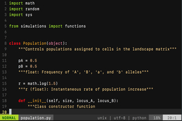
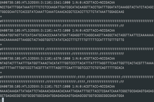
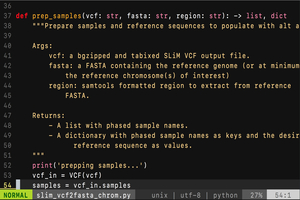

## Parallel evolution

### Experimental and observational work

{: .align-left}Early in my PhD, I helped collect ~12,000 white clover (_Trifolium repens_) plants from 16 cities in eastern North America to quantify the extent to which cities drive the [repeated evolution of hydrogen cyanide](https://ln.sync.com/dl/cbbe249a0/76y3h6gg-q8xu7ei4-4krtps7d-6rwwaqz8) (HCN—an anti-herbivore defense). I am currently co-leading the [Global Urban Evolution Project (GLUE)](http://www.globalurbanevolution.com/), a collaborative effort from ~300 scientists around the world aiming to understand the evolutionary causes and consequences of urbanization on a global scale. Current experimental work is exploring whether urban environments drive the [evolution of multiple, correlated traits.](https://www.biorxiv.org/content/10.1101/699017v2)

<h3 style="text-align: right">Theory</h3>

{: .align-right}To generated null models for the evolution of parallel urban-rural clines in HCN, I simulated the formation of clines under realistic demographic scenarios of genetic drift and gene flow, while accounting for the epistatic genetic architecture of the cyanogenesis phenotype. This work was important in guiding expectations for how often we expect to see the repeated [evolution of HCN clines under only neutral processes.](https://ln.sync.com/dl/ed129ac70/jkuv6wiq-wbi8djmu-7s2r5gz4-vvkxfqrk)

### Genomics

{: .align-left}I am currently sequencing 120 whole white clover genomes from Toronto, Canada, to see whether the observed phenotypic clines are mirrored at the genomic level, and identify other putative targets of selection in response to urbanization. This work will be extended by GLUE, which will sequence ~2,800 whole genomes to understand how cities around the world are driving parallel genomic evolution in the same species.

## Other topics
 
### Herbivore and pollinator-mediated selection

{: .align-left}Previous work of mine at the start of graduate school examined the relative effects of herbivores and pollinators at imposing [selection on reproductive traits](https://ln.sync.com/dl/2af928050/bj8adhg6-9zy72hna-dr4xujcn-j8bnu4wx) in white clover. Given the role that plant defenses can play at influencing interactions with community members, this work also quantivate variation in the strength of herbivore and pollinator-mediated selection among defended and undefended plant genotypes.
 
 
<h3 style="text-align: right">Non-equilibrium population dynamics</h3>

{: .align-right}[Ahmed Hasan](https://aays.github.io/) and I are currently running [theoretical simulations](https://github.com/ness-lab/mrt) to examine how estimates of effective population size (_Ne_) derived from nucleotide diversity or recombination differ when populations are out of equilibrium. We are performing forward-time simulations using the software SLiM with known mutation and recombination rate, and tracking estimates of _Ne_ derived from genome-wide nucleotide diversity and population-scaled recombination every generations pre- and post-bottleneck.
 
 
### Fungal endophytes

{: .align-left}My undergraduate work examined how fungal endophyte frequencies in changed following [removal of rabbit herbivores](https://ln.sync.com/dl/44b777600/w7r5vkvn-cm6e2f53-diqs9mge-jxfwbyv2). I additionally explored the ecological consequences of [fungal endophytes in subarctic _Festuca rubra_ populations](https://ln.sync.com/dl/da715a610/bdteshu9-dh7z3zhc-g6fa3vmh-zea3vigx).
